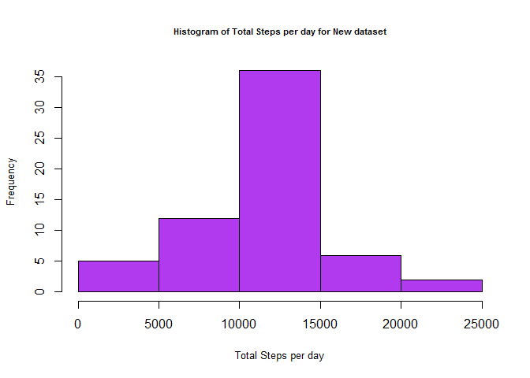

## Loading and preprocessing the data

#### 1.Load the data

```r
unzip("activity.zip")
file<-"activity.csv"
data<-read.csv(file)
```

#### 2.Process/transform the data (if necessary) into a format suitable for your analysis

```r
data$date<-as.Date(data$date)
```

## What is mean total number of steps taken per day?

#### 1.Calculate the total number of steps taken per day

```r
total_steps_day<-aggregate(data$steps~data$date,data,sum,na.rm=TRUE)
colnames(total_steps_day)<-c("date","TotalSteps")
print(total_steps_day)
```

```
##          date TotalSteps
## 1  2012-10-02        126
## 2  2012-10-03      11352
## 3  2012-10-04      12116
## 4  2012-10-05      13294
## 5  2012-10-06      15420
## 6  2012-10-07      11015
## 7  2012-10-09      12811
## 8  2012-10-10       9900
## 9  2012-10-11      10304
## 10 2012-10-12      17382
## 11 2012-10-13      12426
## 12 2012-10-14      15098
## 13 2012-10-15      10139
## 14 2012-10-16      15084
## 15 2012-10-17      13452
## 16 2012-10-18      10056
## 17 2012-10-19      11829
## 18 2012-10-20      10395
## 19 2012-10-21       8821
## 20 2012-10-22      13460
## 21 2012-10-23       8918
## 22 2012-10-24       8355
## 23 2012-10-25       2492
## 24 2012-10-26       6778
## 25 2012-10-27      10119
## 26 2012-10-28      11458
## 27 2012-10-29       5018
## 28 2012-10-30       9819
## 29 2012-10-31      15414
## 30 2012-11-02      10600
## 31 2012-11-03      10571
## 32 2012-11-05      10439
## 33 2012-11-06       8334
## 34 2012-11-07      12883
## 35 2012-11-08       3219
## 36 2012-11-11      12608
## 37 2012-11-12      10765
## 38 2012-11-13       7336
## 39 2012-11-15         41
## 40 2012-11-16       5441
## 41 2012-11-17      14339
## 42 2012-11-18      15110
## 43 2012-11-19       8841
## 44 2012-11-20       4472
## 45 2012-11-21      12787
## 46 2012-11-22      20427
## 47 2012-11-23      21194
## 48 2012-11-24      14478
## 49 2012-11-25      11834
## 50 2012-11-26      11162
## 51 2012-11-27      13646
## 52 2012-11-28      10183
## 53 2012-11-29       7047
```

#### 2.Make a histogram of the total number of steps taken each day

```r
par(cex=1,cex.lab=0.8,cex.main=0.7)
hist(total_steps_day$TotalSteps,xlab = "Total Steps per day",main = "Histogram of Total Steps per day",col = "Gold")
```

<!-- -->

#### 3.Calculate and report the mean and median of the total number of steps taken per day

```r
mean_data<-mean(total_steps_day$TotalSteps)
median_data<-median(total_steps_day$TotalSteps)
print(mean_data)
```

```
## [1] 10766.19
```

```r
print(median_data)
```

```
## [1] 10765
```

## What is the average daily activity pattern?

#### 1.Make a time series plot (i.e.type="l") of the 5-minute interval (x-axis) and the average number of steps taken, averaged across all days (y-axis)

```r
average_steps<-tapply(data$steps,data$interval,mean,na.rm=TRUE)
average_steps<-as.data.frame(average_steps)
colnames(average_steps)<-"AverageSteps"
average_steps$Interval<-as.integer(rownames(average_steps))
par(cex=1,cex.lab=0.9,cex.main=0.9,col="chartreuse")
plot(x=average_steps$Interval,y=average_steps$AverageSteps,xlab ="Interval",ylab ="Average number of steps taken",main = "Time Series Plot",type = "l")
```

<!-- -->

#### 2.Which 5-minute interval, on average across all the days in the dataset, contains the maximum number of steps?

```r
average_steps[which.max(average_steps$AverageSteps),]$Interval
```

```
## [1] 835
```

## Imputing missing values

#### 1.Calculate and report the total number of missing values in the dataset (i.e. the total number of rows with NAs)

```r
sum(is.na(data))
```

```
## [1] 2304
```

#### 2.Devise a strategy for filling in all of the missing values in the dataset. 
We will be filling in the missing values for a particular interval by replacing it with the average of that particular interval averaged across all days.

```r
fillmissingvalues<-function(interval)
{
  average_steps[average_steps$Interval==interval,1]
}
```

#### 3.Create a new dataset that is equal to the original dataset but with the missing data filled in.

```r
newdata<-data
nrows<-nrow(data)
for(i in 1:nrows)
{
  if(is.na(newdata[i,"steps"]))
    newdata[i,"steps"]<-fillmissingvalues(newdata[i,"interval"])
}
head(newdata)
```

```
##       steps       date interval
## 1 1.7169811 2012-10-01        0
## 2 0.3396226 2012-10-01        5
## 3 0.1320755 2012-10-01       10
## 4 0.1509434 2012-10-01       15
## 5 0.0754717 2012-10-01       20
## 6 2.0943396 2012-10-01       25
```

#### 4.Make a histogram of the total number of steps taken each day and Calculate and report the mean and median total number of steps taken per day. Do these values differ from the estimates from the first part of the assignment? What is the impact of imputing missing data on the estimates of the total daily number of steps?

```r
new_total_steps_day<-tapply(newdata$steps,newdata$date,sum,na.rm=TRUE)
new_total_steps_day<-as.data.frame(new_total_steps_day)
colnames(new_total_steps_day)<-"TotalSteps"
new_total_steps_day$date<-rownames(new_total_steps_day)
par(cex=1,cex.lab=0.8,cex.main=0.7)
hist(new_total_steps_day$TotalSteps,xlab = "Total Steps per day",main = "Histogram of Total Steps per day for New dataset",col = "darkorchid2")
```

<!-- -->

```r
newmean<-mean(new_total_steps_day$TotalSteps)
newmedian<-median(new_total_steps_day$TotalSteps)
print(newmean)
```

```
## [1] 10766.19
```

```r
print(newmedian)
```

```
## [1] 10766.19
```
After imputing missing data,the mean has not changed.  
The median has changed from 10765 to 10766.1886792453

## Are there differences in activity patterns between weekdays and weekends?

#### 1.Create a new factor variable in the dataset with two levels – “weekday” and “weekend” indicating whether a given date is a weekday or weekend day.

```r
f<-character()
days<-c("Monday","Tuesday","Wednesday","Thursday","Friday")
for(i in 1:nrows)
{
  if(weekdays(newdata[i,"date"]) %in% days)
     f[i]<-"weekday"
  else
    f[i]<-"weekend"
}
f<-as.factor(f)
newdata$daytype<-f
head(newdata)
```

```
##       steps       date interval daytype
## 1 1.7169811 2012-10-01        0 weekday
## 2 0.3396226 2012-10-01        5 weekday
## 3 0.1320755 2012-10-01       10 weekday
## 4 0.1509434 2012-10-01       15 weekday
## 5 0.0754717 2012-10-01       20 weekday
## 6 2.0943396 2012-10-01       25 weekday
```

#### 2.Make a panel plot containing a time series plot (i.e.type="l") of the 5-minute interval (x-axis) and the average number of steps taken, averaged across all weekday days or weekend days (y-axis).

```r
avg_steps_day<-aggregate(newdata$steps~newdata$interval + newdata$daytype,newdata,mean)
colnames(avg_steps_day)<-c("interval","daytype","averagesteps")
library(ggplot2)
p<-ggplot(avg_steps_day,aes(x=interval,y=averagesteps))+ geom_line(color="deepskyblue1") + facet_wrap(~daytype,nrow=2)
p
```

<!-- -->
